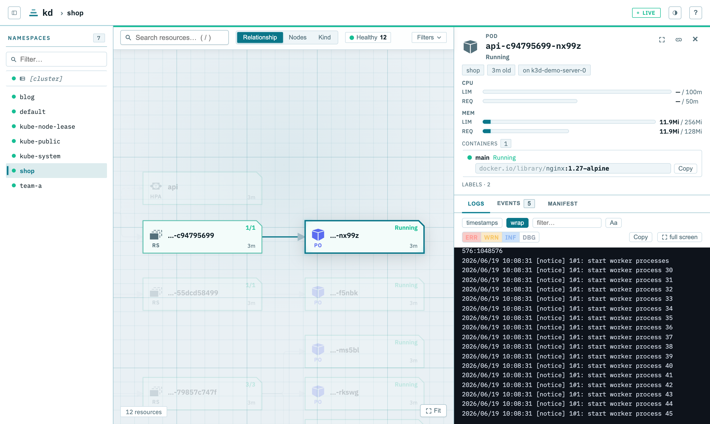
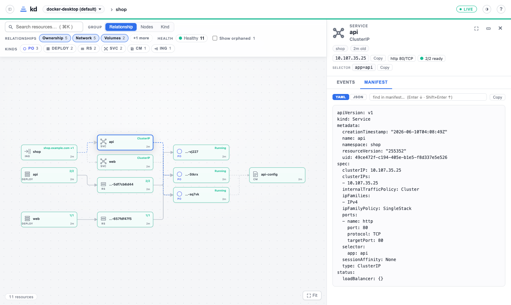
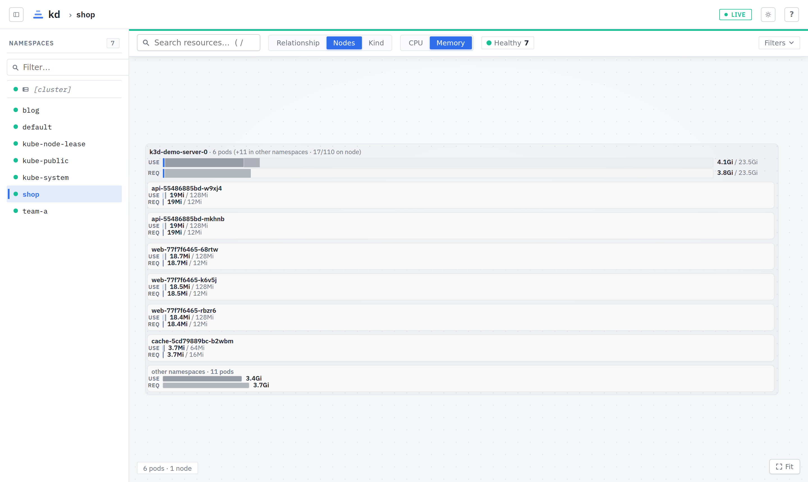
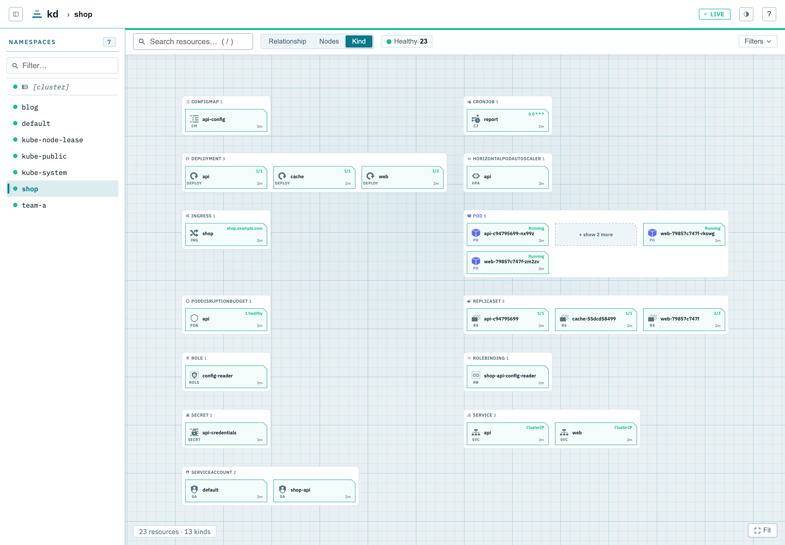

# kd — Kubernetes dashboard



A human-friendly, read-only, live Kubernetes dashboard for cluster operators and application developers.

kd draws your cluster for the human eye — related resources side by side, sizes drawn to scale,
problems standing out in color — so you debug at a glance instead of through a maze of `kubectl` commands.

## Features

There are three main views: Relationship, Nodes, and Kind.

### Relationship view

An ArgoCD-style tree, with resources linked by their relationships.
See at a glance which resource creates or references which one.

Pick which links to draw: ownership, network, volumes, RBAC, disruption, or monitoring.
Custom resources show up too — Workflows, Certificates, ArgoCD Applications, and anything else a CRD defines, down to their Pods.



### Nodes view

All bars are drawn to one shared scale: a node with twice the capacity gets a bar twice as long,
and so does a pod using twice the memory. Big things look big and small things look small,
just as you would expect.
Use this view to instantly spot which nodes and pods use the most CPU and memory.



### Kind view

Every resource in the namespace is shown, grouped by its kind.
Use this view to find a resource by its kind.



## Run locally

kd reads your kubeconfig and serves the dashboard on http://localhost:9123/.

- Download and run the `kd` binary from [the latest GitHub Releases](https://github.com/motoki317/kd/releases)
- If you have [Nix](https://nixos.org/) (flakes enabled): `nix run github:motoki317/kd`
- If you have [mise](https://mise.jdx.dev/): `mise x github:motoki317/kd@latest -- kd`

## Deploy to a cluster

```bash
helm install kd oci://ghcr.io/motoki317/charts/kd --namespace kd --create-namespace
```

The chart runs the official multi-arch image `ghcr.io/motoki317/kd` as a read-only Deployment
behind a forward-auth proxy. To build your own image instead: `docker build -t <ref> .` (one
static image, web embedded), then set `image.repository`.

kd has no login of its own. It trusts a user header (`X-Forwarded-User`) from your proxy and checks
access with a `policy.yaml` file — roles bundle allow/deny rules, users and groups are assigned
roles, and the file is reloaded when it changes. See [charts/kd/README.md](charts/kd/README.md)
for the format, the full setup, and every value.

## Development

You need Go 1.26+, Node 24+, and a working `kubectl` context. With Nix, `nix develop` sets up the tools.

```bash
just dev   # API on :9123, web on :5173 — open http://localhost:5173
```

To build and run the real binary:

```bash
just build
./kd   # Web on :9123
```

Client changes follow [the design language](docs/design.md) and [client gotchas](docs/client-gotchas.md).
